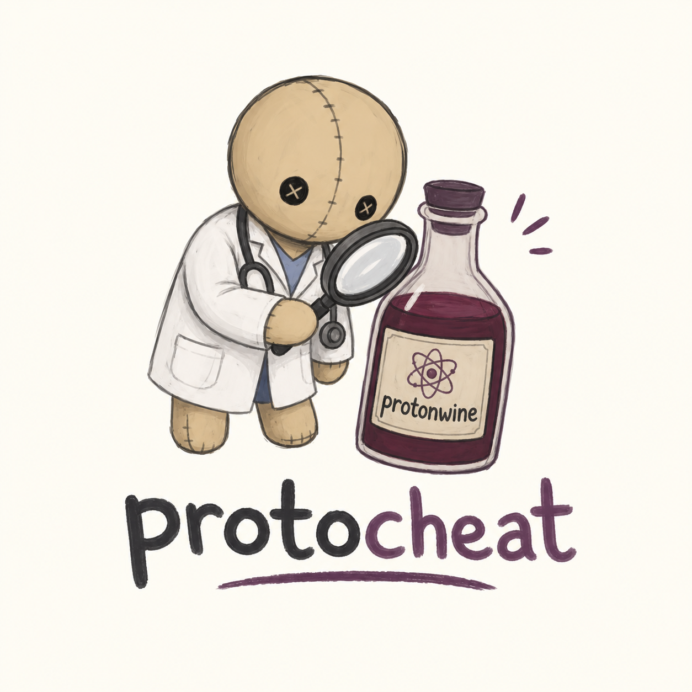

# ProtoCheat



ProtoCheat is a diagnostic helper for Proton, Wine, Lutris, Heroic and Bottles when a game ships anti-cheat. It explains why a title fails and what setup is missing. It does not bypass anti-cheat.

## What it does

- Checks `/dev/ntsync`, runners, and runtimes with `protocheat doctor`
- Looks up a local matrix with `protocheat check` and `protocheat explain`
- Validates an EasyAntiCheat depot with `protocheat depot`
- Leaves kernel anti-cheat alone and documents the limit

## Install

```sh
cargo build -p protocheat-cli
./target/debug/protocheat doctor
```

## Commands

```sh
protocheat doctor
protocheat doctor --json
protocheat check "Apex Legends"
protocheat explain Valorant
protocheat depot ./EasyAntiCheat
protocheat matrix
```

## Scope

Supported path: EAC and BattlEye titles where the publisher enabled Proton mode, plus native VAC. Out of scope: Vanguard, Ricochet, EA AntiCheat proprietary builds, Bungie proprietary builds, GameGuard and XIGNCODE3 for online play. Those need a Windows kernel driver with no Linux equivalent.

## Contributing

See CONTRIBUTING.md. All commits need `Signed-off-by` in the DCO format. Example trailer used in this repo:

`Signed-off-by: fis4med2 <fis4med2@users.noreply.github.com>`

## License

MIT OR Apache-2.0. See LICENSE-MIT and LICENSE-APACHE.
